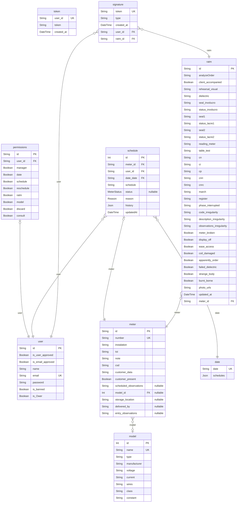

# EDP API
> Generated by [`prisma-markdown`](https://github.com/samchon/prisma-markdown)

- [default](#default)

## default

### `token`

**Properties**
  - `user_id`: 
  - `token`: 
  - `created_at`: 

### `permissions`

**Properties**
  - `id`: 
  - `user_id`: 
  - `manager`: 
  - `date`: 
  - `schedule`: 
  - `reschedule`: 
  - `ratm`: 
  - `model`: 
  - `discard`: 
  - `consult`: 

### `user`

**Properties**
  - `id`: 
  - `is_user_approved`: 
  - `is_email_approved`: 
  - `name`: 
  - `email`: 
  - `password`: 
  - `is_banned`: 
  - `is_Ower`: 

### `model`

**Properties**
  - `id`: 
  - `name`: 
  - `type`: 
  - `manufacturer`: 
  - `voltage`: 
  - `current`: 
  - `wires`: 
  - `class`: 
  - `constant`: 

### `meter`

**Properties**
  - `id`: 
  - `number`: 
  - `instalation`: 
  - `toi`: 
  - `note`: 
  - `csd`: 
  - `customer_data`: 
  - `customer_present`: 
  - `scheduled_observations`: 
  - `model_id`: 
  - `storage_location`: 
  - `delivered_by`: 
  - `entry_observations`: 

### `date`

**Properties**
  - `date`: 
  - `schedules`: 

### `schedule`

**Properties**
  - `id`: 
  - `meter_id`: 
  - `user_id`: 
  - `date_date`: 
  - `schedule`: 
  - `status`: 
  - `reason`: 
  - `history`: 
  - `updatedAt`: 

### `ratm`

**Properties**
  - `id`: 
  - `analyzeOrder`: 
  - `client_accompanied`: 
  - `rehearsal_visual`: 
  - `dielectric`: 
  - `seal_involucro`: 
  - `status_involucro`: 
  - `seal1`: 
  - `status_lacre1`: 
  - `seal2`: 
  - `status_lacre2`: 
  - `reading_meter`: 
  - `table_test`: 
  - `cn`: 
  - `ci`: 
  - `cp`: 
  - `cnri`: 
  - `cnrc`: 
  - `march`: 
  - `register`: 
  - `phase_interrupted`: 
  - `code_irregularity`: 
  - `description_irregularity`: 
  - `observations_irregularity`: 
  - `meter_broken`: 
  - `display_off`: 
  - `ease_access`: 
  - `coil_damaged`: 
  - `apparently_order`: 
  - `failed_dielectric`: 
  - `strange_body`: 
  - `burnt_borne`: 
  - `photo_urls`: 
  - `updated_at`: 
  - `meter_id`: 

### `signature`

**Properties**
  - `token`: 
  - `type`: 
  - `created_at`: 
  - `user_id`: 
  - `ratm_id`: 